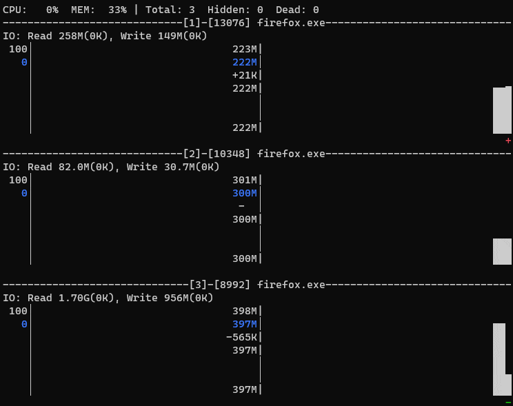

# Process Watcher (PWatch)


- [Description](#description)
    - [Options](#options)
- [Short Demo](#short-demo)
    - [Screen Explanation](#screen-explanation)
- [Precompiled binaries](#precompiled-binaries)
- [Graph Quality](#graph-quality)
- [Scaling Mode](#scaling-mode)
- [Measuring Difference](#measuring-difference)
- [Hot Keys](#hot-keys)
- [Dead processes](#dead-processes)

## Description

PWatch provides a dynamic real-time view of running processes with historical graphs.
The application is akin to well-know utility `top`. But while `top` is great for quick system overview,
`PWatch` can be used to watch one or few  processes closely. With `PWatch` one can analyze what has happened to
a process in the past, even if the process is [already dead](#dead-processes). `PWatch` does not remove dead processes from the screen,
so it possible to check the memory and CPU usage before the process exited and `PWatch` displays how much time
ago the process finished.

To start watching processes, run `PWatch`:

```
pwatch PID_LIST|REGEX [OPTIONS]
```

If the argument contains only digits and commas, the argument is considered a PID list. Otherwise the argument is
a regular expression. Two notes about regular expressions: a) they are always case-insensitive, so `pwatch firefox`
will watch on `firefox`, `FireFox` and so on; b) the regex filters processes which *path to binary* matches it, not
only binary name, that allows to watch a set of differently-named processes started from the same directory.

### Options

| Short name | Long name | Description | Values |
| --- | --- | --- | --- |
| v | version | Show application version | |
| q | quality | Set [graph quality](graph-quality) | One of `high`, `medium` or `low` |
| r | refresh | Set refresh interval in milliseconds | Default value is `1000`, only numbers within range `250`..`10000` can be used |
| s | scale | Select memory graph scaling mode | `zero` - the graph display range is from `0` to `maximum`; `min`(default) - from `minimum` to `maximum` |
| t | title | Set title for a process | `cmd`(default) - process command line, `path` - path to binary, `name` - binary name | 

## Short Demo

The image below displays what happens to a few Firefox processes after a user clicks "Refresh" button in the browser:



When the number of processes is low, instead of showing CPU and MEM graphs side by side (as in the example), the application
displays CPU on top of MEM graph. It allows `PWatch` to provide longer usage history.

### Screen Explanation

The first line is a system total numbers:

```
CPU:   0%  MEM:  33% | Total: 3  Hidden: 0  Dead: 0
```

The line with `I/O` is the total and the change since the previous measurement(in braces) amount of read and write data.
For Linux it should display disk I/O, for Windows it is total I/O for the process including disks.

CPU and MEM is total used amount in a range 0..100%. `Total` is the number of processes `PWatch` looks after.
`Hidden` is the number of processes that are not displayed at this moment, but you can scroll to see them.
`Dead` the number of processes that exited while `PWatch` is watching the processes. [Dead processes](#dead-processes) are not removed
from the screen, but `PWatch` stops updating them, so dead process graph are kind of frozen.

CPU and MEM graphs have the same header. The MEM one is used to describe what they show:

```
 226M|
 225M|
 +16K|     ▂▂▂▂▂▁
     |    █████████
 225M|  ███████████
          ++    --
```

Note: the graph in the example is drawn in the best quality mode. See more about [quality modes here](#graph-quality)

Top and bottom values are the graph display range. The values are always exact, so it this example, the top of the
graph is exactly `226 MiB` and the bottom line is `225 MiB`. Please note that for CPU the bottom values is missing.
It is because the bottom CPU line is always `0%`, so to minimize visual noise it is hidden. For memory the bottom
value may be of any value depending on [memory scaling modes](#scaling-mode).

The number under top value is the current value - it the value that `top` shows. The value is always drawn in blue
color for easier reading the current consumption. The current value is just a rounded real value.

The number under the current consumption is the change since some time in the past. By default, it is the difference
between the current value and previously measured. But if you [set a mark](measuring-difference), the difference is
calculated between the current value and the value at the time when the mark was set. This value either empty (in this
case is is displayed as `-`), or a number with `+`' or `-` sign.

Under the difference there is the last number - all-time maximum. It is the maximum usage of CPU and memory by the
process since the monitor starts. The value can be reset with hotkey `r`.

The line of `+`'s and `-`'s marks points in time when the value changed. It may look redundant, but when changes are
so small that the graph remains a straight line, these extra characters may come in handy.

## Precompiled binaries

For Windows and Ubuntu you can download precompiled binaries from [Release page](https://github.com/VladimirMarkelov/pwatch/releases).

* Windows binary tested on Windows 10.
* musl-Linux build

## Graph Quality

By default, graph are drawn in the best quality. But not every font supports used characters, so one can lower graph
detalization if a terminal font lack some characters. E.g., `Consolas` and `Currier New` have only 3 of required 9
characters, so they can be used only for `medium` quality.

| Quality | Character set |
| --- | --- |
| Low | ` ` and `█`(full block) |
| medium | ` `, `▄`(half block), and `█` |
| high | ` ▂▃▄▅▆▇█` |

## Scaling Mode

Scaling mode is applied to memory graph only. CPU graph has only one mode: from `0%` to `100%` (if process CPU usage
exceeds `100%`, the CPU is rescaled so the top value of the graph is always a number divisible by `100`).

To make small memory usage changes more distinguishable, from start the application displays the memory consumption
graph between lowest (rounded down) and highest (rounded up) usage from the values visible on the graph. Pressing
key `F12` switches between this mode and standard one: when the graph is scales from 0(bottom) to highest usage
since the monitoring starts(top).

## Measuring Difference

Hotkey `SPACE` switches between two ways of calculating the difference. Default way shows the difference between
the previous and the current consumptions. After pressing `SPACE`, the message `Delta for last 0s` is show at the
top, `PWatch` remembers the current value, and then it shows the difference between the current and remembered 
value.

## Hot Keys

| Key | Description |
| --- | --- |
| F1 | Show/hide the short hotkey "tooltip" at the top of the window |
| F9 | Switch process title: `full command line`(default) - the end of it if it is longer than the screen width, `full path to binary`, `binary name` |
| F12 | Switch memory scaling mode: `from min to max`(default), `from 0 to max` |
| r | Reset all-time maximum: set the maximum to the maximum in visible interval |
| SPACE | Set/Unset the point in time from which the usage difference is calculated |
| q | Exit |
| ESC | Exit |
| Arrows, PageUp, and PageDown | Scroll the list of processes if some of them are out of screen |
| Home | Scroll to the first process in the list |
| End | Scroll so the last process in the list is visible |

## Dead processes

Even when a process exits, `PWatch` does not remove the process graphs. It keeps displaying the last registered values,
and add a message (it replaces CPU's "+/-" bottom line) how much time ago the process finished. It is very useful to
check what happens before the process exited or crashed without constant staring at the screen.
